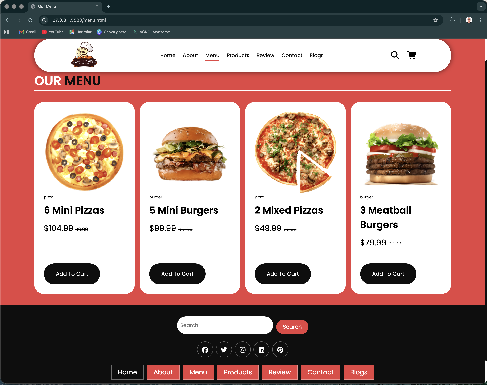
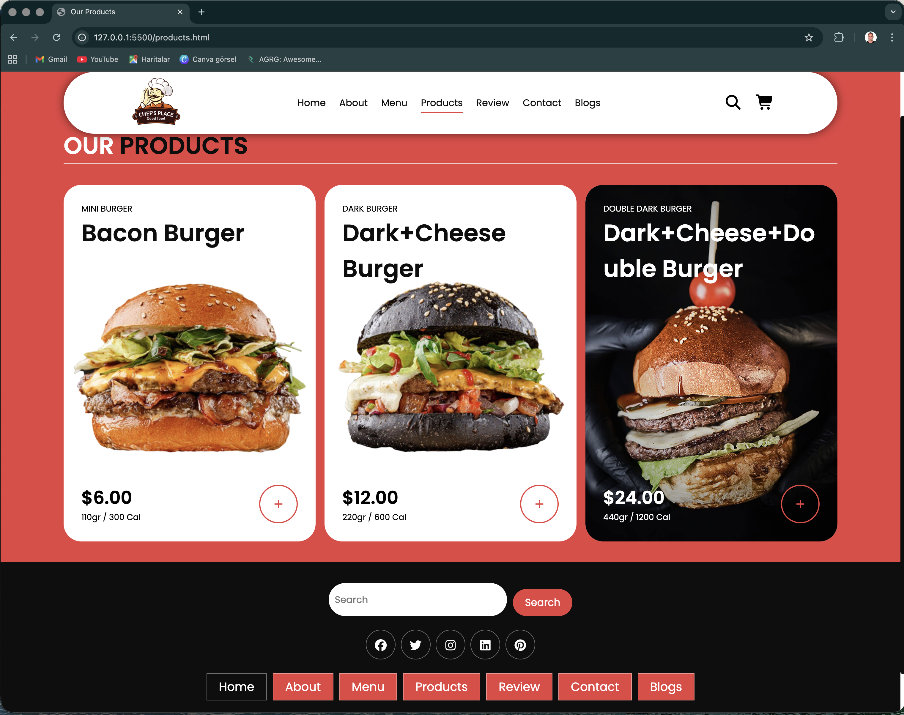
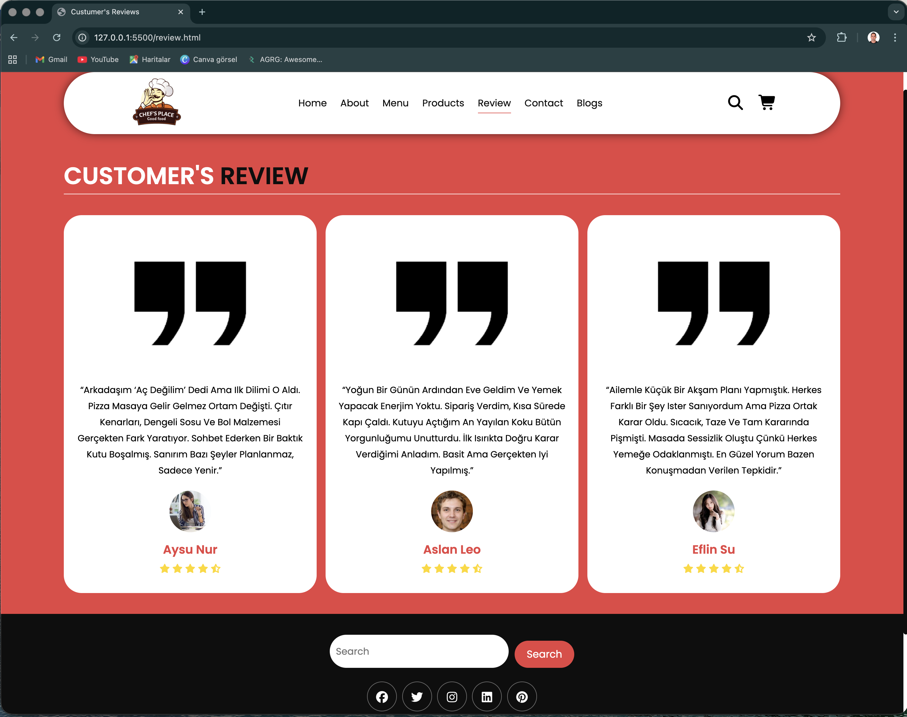
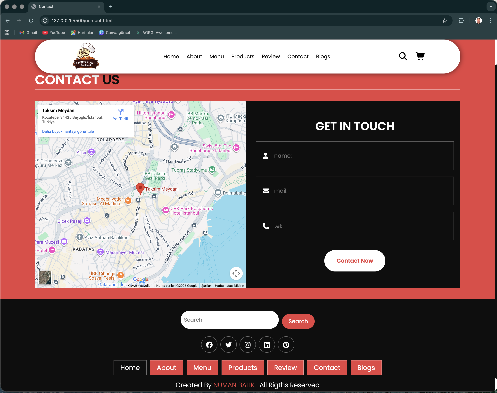
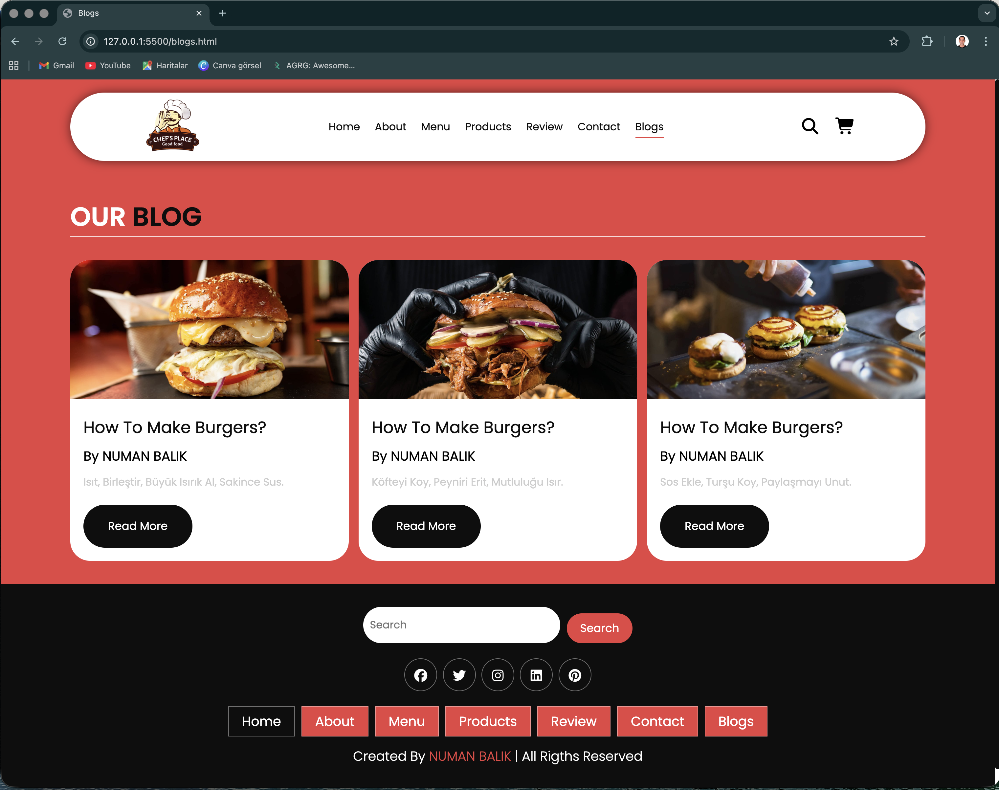
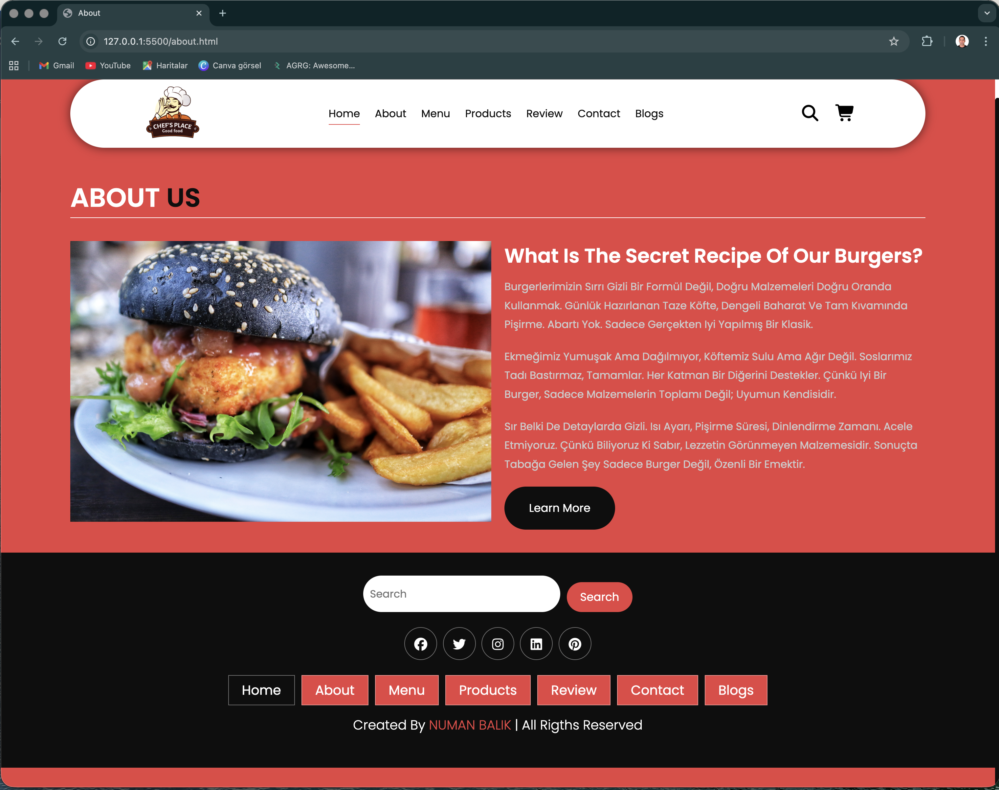

 # 🍕 Chef's Palace - Restaurant Web Site

### A Modern, Full-Featured Restaurant Web Application

**[🌐 View Live Demo](https://chefspalace.netlify.app/)** | **[📖 Documentation](#-features)** | **[📧 Contact](#-contact)**

---

## 📖 Overview

Chef's Palace is a comprehensive, production-ready restaurant web application that combines elegant design with powerful functionality. Built entirely with vanilla HTML, CSS, and JavaScript, this project demonstrates mastery of front-end web development fundamentals while delivering a premium user experience across all devices.

This isn't just a template—it's a fully-functional website ready for real-world deployment, showcasing professional-grade code architecture, responsive design patterns, and modern web development best practices.

---

## ✨ Key Features

<table>
<tr>
<td width="50%">

### 🎨 **User Experience**
- **7 Fully Responsive Pages** - Seamless navigation across the entire site
- **Interactive Menu System** - Browse dishes with detailed descriptions
- **Smooth Animations** - Professional transitions and micro-interactions
- **Mobile-First Design** - Optimized for all screen sizes
- **Fast Loading Times** - Optimized assets and efficient code

</td>
<td width="50%">

### ⚡ **Technical Excellence**
- **Clean Code Architecture** - Maintainable and scalable structure
- **Cross-Browser Compatible** - Works on Chrome, Firefox, Safari, Edge
- **SEO Optimized** - Semantic HTML and proper meta tags
- **Accessibility Ready** - WCAG compliant markup
- **Performance Focused** - Lighthouse score optimized

</td>
</tr>
</table>

---

## 🎥 Live Preview

### Interactive Demo

[👉 Experience it live on Netlify]  (https://chefspalace.netlify.app/)** 
Experience the full restaurant website in action! Click above to explore all features, pages, and animations.

---

## 🖼️ Screenshots Gallery

### 🏠 Home Page

*Welcoming hero section with featured dishes and restaurant highlights*

### 🍽️ Menu Page

*Comprehensive menu with categories and detailed dish information*

### 🛍️ Products Showcase

*Special offerings and seasonal promotions*

### 👥 About Us

*Restaurant story, team introduction, and values*

### 📝 Blog Section

*Engaging culinary articles and cooking tips*

### ⭐ Customer Reviews

*Real testimonials and customer feedback*

### 📞 Contact Page

*Interactive contact form and location information*

---

## 🛠️ Technologies & Tools

### Core Technologies

### Development Tools

### Technical Implementation

- **HTML5** - Semantic markup, accessibility features, SEO optimization
- **CSS3** - Flexbox & Grid layouts, CSS animations, custom properties, responsive design
- **JavaScript** - DOM manipulation, event handling, form validation, interactive features
- **Git & GitHub** - Version control, collaborative development workflow
- **Netlify** - Continuous deployment, hosting, and performance optimization

---

## 📁 Project Structure

restaurant-web-site/
│
├── 📄 index.html          # Home page - Hero section & featured content
├── 📄 menu.html           # Menu page - Complete food listings
├── 📄 products.html       # Products page - Special offerings
├── 📄 about.html          # About page - Restaurant story & team
├── 📄 blogs.html          # Blog page - Articles & recipes
├── 📄 review.html         # Reviews page - Customer testimonials
├── 📄 contact.html        # Contact page - Form & location
│
├── 📁 images/             # Optimized image assets
│   ├── logo.png
│   ├── hero-banner.jpg
│   ├── dishes/
│   └── team/
│
├── 📁 styles/             # Modular CSS files
│   ├── main.css           # Global styles
│   ├── responsive.css     # Media queries
│   ├── animations.css     # Transitions & effects
│   └── components.css     # Reusable components
│
├── 📁 js/                 # JavaScript modules
│   ├── main.js            # Core functionality
│   ├── navigation.js      # Menu & routing
│   ├── form-validation.js # Contact form
│   └── animations.js      # Interactive effects
│
└── 📁 screen/             # Documentation assets
├── screen1-7.png      # Page screenshots
└── demo-video.gif     # Interactive demo

---

## 💡 What I Learned

This project was a comprehensive learning journey that challenged me to apply and master multiple aspects of modern web development:

### Technical Mastery

✅ **Advanced HTML5** - Semantic structure, accessibility attributes, SEO meta tags  
✅ **Modern CSS3** - Grid & Flexbox layouts, CSS variables, animations, responsive design  
✅ **Vanilla JavaScript** - DOM manipulation, event delegation, async operations  
✅ **Responsive Design** - Mobile-first approach, breakpoint strategies, fluid typography  
✅ **Web Performance** - Image optimization, lazy loading, efficient code splitting  
✅ **Cross-Browser Testing** - Compatibility fixes, progressive enhancement  
✅ **Version Control** - Git workflow, branching strategies, collaborative development  

### Professional Development

📊 **Project Planning** - Wireframing, user flow mapping, feature prioritization  
🎨 **UI/UX Design** - Color theory, typography, visual hierarchy, user psychology  
🔍 **Problem Solving** - Debugging complex issues, finding elegant solutions  
📖 **Code Documentation** - Writing clear README, inline comments, maintainable code  
⏱️ **Time Management** - Breaking tasks into sprints, meeting deadlines  
🎯 **Attention to Detail** - Pixel-perfect implementation, consistent styling  

---

## 🎯 Skills Demonstrated

<table>
<tr>
<td width="33%">

### 💻 Frontend Development
- Semantic HTML5
- Advanced CSS3
- Vanilla JavaScript
- Responsive Design
- Web Animations
- Form Validation

</td>
<td width="33%">

### 🎨 Design & UX
- UI/UX Principles
- Color Theory
- Typography
- Visual Hierarchy
- User Flow Design
- Accessibility (A11y)

</td>
<td width="33%">

### 🚀 Best Practices
- Clean Code
- DRY Principles
- Mobile-First
- SEO Optimization
- Performance Tuning
- Version Control

</td>
</tr>
</table>

---

## 🙏 Acknowledgments

### Special Thanks

#### 🎓 **Udemig**
I am deeply grateful to **[@udemig](https://github.com/udemig)** for providing world-class education in modern web development. The comprehensive curriculum, hands-on projects, and supportive learning environment have been instrumental in my growth as a developer. This project is a direct result of the knowledge and skills I gained through their exceptional training program.

#### 👨‍🏫 ** Mehmet Can SEYHAN - My Mentor**
I want to express my profound gratitude to my instructor ## 👨‍🏫 **[Mehmet Can SEYHAN](https://github.com/isveckrali)** - My Mentor
**, whose dedication and expertise have transformed my understanding of web development. His patient guidance, insightful feedback, and real-world industry experience have not only taught me how to code, but more importantly, how to *think* like a professional developer. His passion for teaching and commitment to student success have been a constant source of inspiration throughout this journey.

---

## 📞 Contact & Connect

**Let's build something amazing together!**

---
### 📱 Full Page Screenshot

*Complete website overview in one view*

### ⭐ If you found this project valuable, please consider giving it a star!

**Made with ❤️ and countless cups of ☕ by Numan Balık**

*"Great web experiences are built one line of code at a time"*

---

© 2026 Chef's Palace Restaurant Web Site. All rights reserved.

